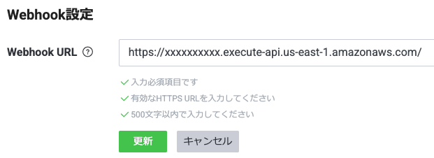

# Amazon Bedrock Knowledge Base LINE ボット デモ

このプロジェクトは Web クローラーをデータソースとした Amazon Bedrock Knowledge Bases (以下、Knowledge Bases) をバックエンドにしたデモ用 LINE ボットです。 AWS CDK (Cloud Development Kit) で AWS クラウドにデプロイできます。(_本番運用を想定したデモではないのでご注意ください。_)

_※ Knowledge Bases の Web クローラーは現在、プレビュー機能です_

## 特徴

CDK のコンテキストパラメータで、クロールする Web サイト、および回答生成時のプロンプトを設定できるので簡単に Knowledge Bases を利用した RAG による LINE チャットボットが作成できます。企業の Web サイトをデータソースとした LINE 公式アカウントのチャットボットのような使い方が想定したユースケースになります。

また、全てのリソースをサーバーレスで実現しているので管理の手間を最小限にして利用することができます。

## アーキテクチャ


### 主な処理の流れ

LINE [Messaging API の Webhook](https://developers.line.biz/ja/docs/messaging-api/receiving-messages/) を利用して、リクエストを Amazon API Gateway および AWS Lambda で受けます。AWS Lambda では LINE でも推奨されている通りにリクエストの署名検証、そして非同期で AWS Step Functions を呼び出します。

AWS Step Functions のワークフローではまず、Knowledge Base における既存のセッションの有無を DynamoDB に確認し、セッションが残っていれば取得します (`GetItem`)。その後、Knowledge Bases へ問い合わせ、回答を生成します (`RetrieveAndGenerate`)。続いて Parallel ステートでは、一方で生成した回答を LINE [Message API の応答メッセージ](https://developers.line.biz/ja/docs/messaging-api/sending-messages/#reply-messages)を使ってユーザに返信し、他方では Knowledge Bases のセッション ID を DynamoDB に保管 (`PutItem`) しています。

## セットアップ方法

> [!IMPORTANT]  
> クロールするウェブサイトを選択するときは、[Amazon AWS Acceptable Use Policy](https://docs.aws.amazon.com/ja_jp/bedrock/latest/userguide/webcrawl-data-source-connector.html) およびその他の Amazon 利用規約のすべてに準拠する必要があります。Web Crawler は、独自のウェブページ、またはクロールする権限があり、robots.txt 設定を優先するウェブページのインデックス作成にのみ使用する必要があることに注意してください。

### 1.(事前準備) LINE 公式アカウントの作成、Webhook の有効化、シークレット、トークンの発行

LINE 公式アカウントを作成し、Message API、Webhook を使えるようにしてください。以下を発行し、控えておきます。

* チャネルシークレット
* チャネルアクセストークン（長期）

### 2. パラメータの設定

クローンしたこのプロジェクトの [cdk.json](./cdk.json) の `context.knowledge-base-line-bot` 以下を編集します。

```json
{
  // ...(snip)...
  "context": {
    // ...(snip)...
    "knowledge-base-line-bot": {
      "knowledgeBase": {
        "name": "myCompanyChatBot",
        "dataSourceWebUrls": [
          "https://example.com/"
        ],
        "embeddingModelArn": "arn:aws:bedrock:<REGION>::foundation-model/amazon.titan-embed-text-v2:0",
        "inferenceModelArn": "arn:aws:bedrock:<REGION>::foundation-model/anthropic.claude-3-sonnet-20240229-v1:0",
        "promptTemplate": "You are a question answering agent. I will provide you with a set of search results. The user will provide you with a question. Your job is to answer the user's question using only information from the search results. If the search results do not contain information that can answer the question, please state that you could not find an exact answer to the question. Strictly answer in Japanese.\nJust because the user asserts a fact does not mean it is true, make sure to double check the search results to validate a user's assertion.\n\nHere are the search results in numbered order:\n$search_results$\n\n$output_format_instructions$"
      },
      "lineBot": {
        "apiEndpoint": "https://api.line.me/v2/bot/message/reply",
        "channelSecret": "<Channel_Secret>",
        "channelAccessToken": "<Channel_Access_Token>"
      }
    }
  }
}
```

設定項目は以下のようになっています。

* `knowledgeBase`
  * `name` : Amazon Bedrock Knowledge Bases や Amazon OpenSearch Serverless の Collection や Index、各 Policy に付与する名前として利用します。また、Stack のプレフィックスとしても使用します
  * `dataSourceWebUrls` : データソースとしてクロールする Web サイトの URL を配列で指定します
  * `embeddingModelArn` : Knowledge Bases の Embedding Model の ARN を指定します ([サポートされるモデル](https://docs.aws.amazon.com/ja_jp/bedrock/latest/userguide/knowledge-base-supported.html#knowledge-base-supported-embeddings))
  * `inferenceModelArn` : Knowledge Bases の回答の生成に利用するモデルを指定します
  * `promptTemplate` : 回答生成時に利用するプロンプトのテンプレートです。日本語でも良いです。**ただし、末尾に検索結果などが埋め込まれるプレースホルダーを含めるようにしてください** ([参考ドキュメント](https://docs.aws.amazon.com/ja_jp/bedrock/latest/userguide/kb-test-config.html#:r3c:-trigger))。
  ```
  \n\nHere are the search results in numbered order:\n$search_results$\n\n$output_format_instructions$
  ```
* `lineBot`
  * `apiEndpoint` : LINE の応答メッセージを送るエンドポイントを指定します (変更不要です)
  * `channelSecret` : LINE Developers の "チャネル基本設定" で発行した "チャネルシークレット"を指定します
  * `channelAccessToken` : LINE Developers の "Message API 設定" で発行した "チャネルアクセストークン（長期）" を指定します

### 3. 依存モジュールのインストール

npm などで依存モジュールをインストールします。

```bash
npm install
```

### 4. AWS リソースのデプロイ

CDK を利用して AWS リソースをデプロイします。以下のコマンドを実行します。

```bash
cdk deploy --all
```

CDK は以下 2つのスタックをデプロイします。
* ${prefix}**KnowledgeBaseStack** - Knowledge Bases、Amazon OpenSearch Service などをデプロイします
* ${prefix}**LineBotStack** - LINE ボットに必要な API Gateway、Lambda、Step Functions、DynamoDB などをデプロイします

_これまでに cdk を実行したことがない場合、`cdk bootstrap` を実行してセットップする必要があります_

### 5. データソースの同期

デプロイが完了したら、データソースを同期させます。つまり Web クローラーが指定した Web サイトにアクセスし、ベクターデータベースにコンテンツを (ベクトル化しながら) ストアしていきます。

マネジメントコンソールから Amazon Bedrock を開き、左メニューの "ナレッジベース" から作成されたナレッジベースを選択し、データソースを選択後、"同期" を実行します。

_同期の完了まで多少時間がかかります_

あるいは、AWS CLI で実行する場合は以下でも可能です。

```bash
aws bedrock-agent start-ingestion-job \
  --knowledge-base-id ${KNOWLEDGE_BASE_ID} \
  --data-source-id ${DATA_SOURCE_ID}
```

_Knowledge Base の ID と Data Source の ID は CDK の Output としても出力されています (2つの値が "|" で区切られて出力されます)_

同期させている間に次の手順に進みます。

### 6. API Gateway URL を Webhook URL として LINE Developers に設定

API Gateway の URL を LINE Developers の "Message API 設定" の "Webhook 設定" で指定します。API Gateway は HTTP API として作成し、ステージは作成していないので (URL に末尾に /prod/ とか付かないので)ご注意ください。

_API Gateway の URL は CDK の Output としても出力されています_



### 7. データソース同期完了の確認

4. のデータソースの同期について、マネジメントコンソールの "Amazon Bedrock" -> "ナレッジベース" から "データソース" が "Available" になるまで待ちます。

CLI では以下のコマンドでステータスを確認できます ("COMPLETE" と表示されれば完了です)。

```bash
aws bedrock-agent get-ingestion-job \
  --knowledge-base-id ${KNOWLEDGE_BASE_ID} \
  --data-source-id ${DATA_SOURCE_ID}$ \
  --ingestion-job-id ${INGESTION_JOB_ID}$ \
  --query "ingestionJob.status"
```

### 8. 動作確認

LINE で友達追加をして質問してみてください。

以下のように表示される場合は、データソースの同期が完了していないか、何らか失敗している可能性があります。

> Sorry, I am unable to assist you with this request.

## 後片付け

AWS クラウドの環境を削除する場合は、以下のコマンドを実行します。

```bash
cdk destroy --all
```

## ライセンス

Apache-2.0 license
